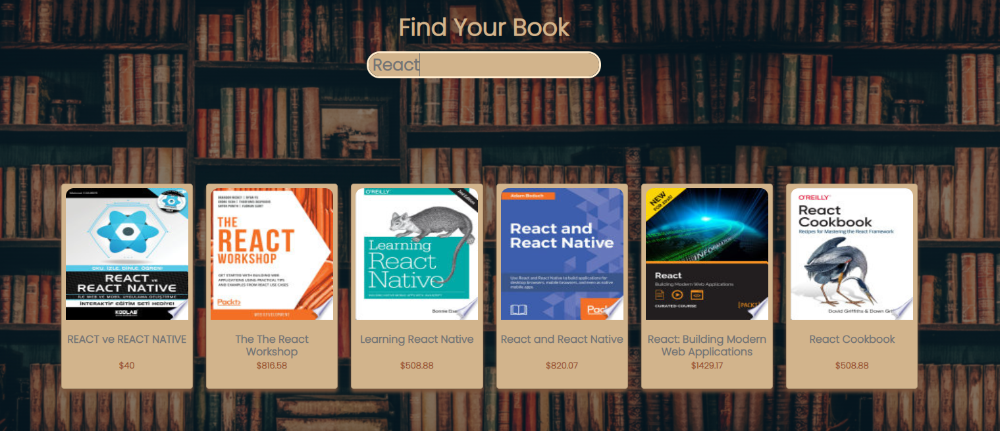
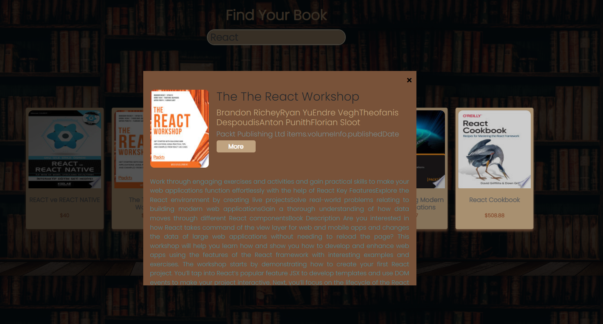

https://searchbookpatika.netlify.app siteye linkten ulaşabilirsiniz 
Patika Fmss Practium 6. Ödevdir. Burada Kitap Arama Uygulaması yapmaktayım. 
Kullandığım api google books adlı api dir. Cardlara tıkladığınızda bir tane modal açılmaktadir. 
O Modalın içinde kitap ile ilgili bilgiler vardır. O bilgiler ise şunlardır ; Kitap adı , Kitabın yazarının adı, Kitabı yayimlandığı tarih vs. 
Görseller aşağıda mevcuttur. 

